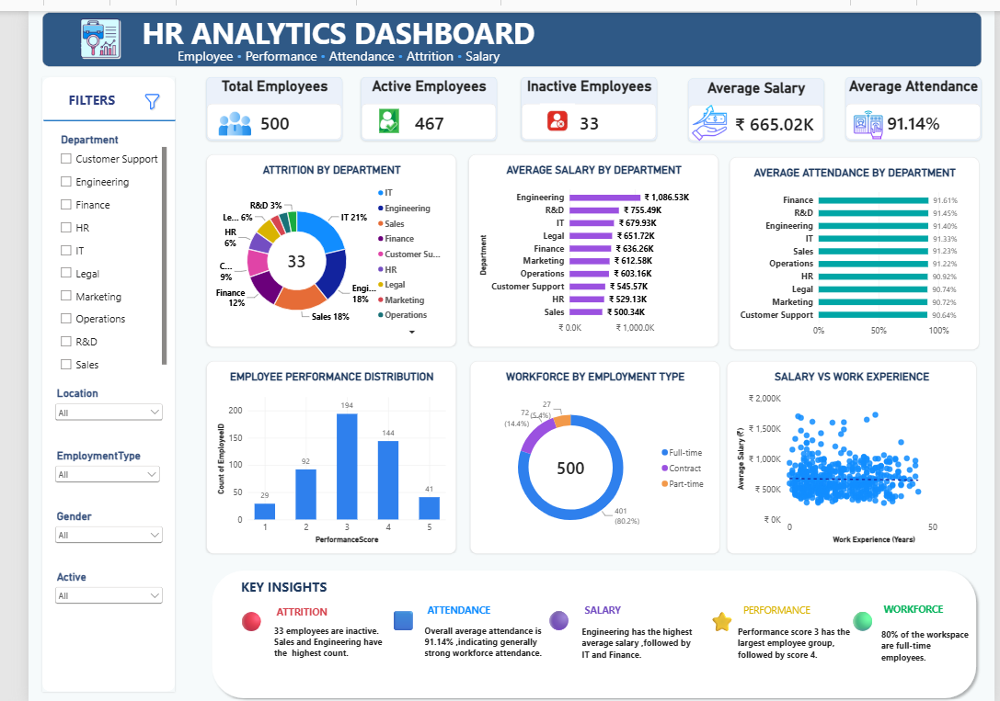

# HR Analytics Dashboard

## 📌 Project Overview
The HR Analytics Dashboard is an interactive data visualization project developed using Microsoft Power BI. It helps analyze employee data and provides meaningful insights into workforce composition, employee status, salary, attendance, performance, and work experience.

## 🎯 Project Objectives
- Analyze the total employee workforce.
- Monitor active and inactive employees.
- Analyze employee attrition.
- Compare average salary across departments.
- Analyze employee attendance patterns.
- Understand employee performance distribution.
- Analyze workforce composition by employment type.
- Explore the relationship between salary and work experience.

## 📊 Dashboard Features
The dashboard includes:

- Total Employees
- Active Employees
- Inactive Employees
- Average Salary
- Average Attendance
- Attrition by Department
- Average Salary by Department
- Average Attendance by Department
- Employee Performance Distribution
- Workforce by Employment Type
- Salary vs Work Experience
- Interactive Filters for better analysis

## 🛠️ Tools & Technologies Used
- Microsoft Power BI
- DAX
- Data Analysis
- Data Visualization

## 📈 Key Insights
- Total Employees: 500
- Active Employees: 467
- Inactive Employees: 33
- Average Attendance: 91.14%
- Employee data is analyzed across departments, employment types, performance scores, and work experience.

## 📷 Dashboard Preview



## 📁 Repository Contents

```text
HR-Analytics-Dashboard/
│
├── HR Analytics Dashboard.pbix
├── README.md
├── dashboard.png
└── HR Analytics Report.pdf
